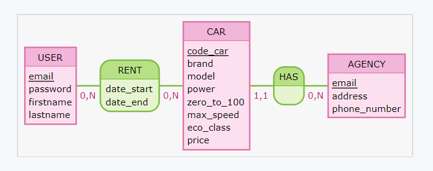

# Projet O'To

Le client, une entreprise de location de véhicules, souhaite une application mobile à destination de ses clients afin qu'ils puissent connaitre les véhicules diponibles dans une agence qu'ils ont choisi au préalable et de pouvoir en réserver un pendant une journée.

Chaque véhicule se démarque par :

- la marque
- le modèle
- la puissance en cheveaux
- le temps du 0 à 100
- la vitese maximale
- la classe energétique
- le tarif journalier
- l'agence dans laquelle il est stockée

Chaque agence est joignable par courrier postale, email ou téléphone. A savoir que la stratégie marketing du client fait qu'il ne peut pas avoir plusieurs agence dans une même ville.

### User stories 

*Application O'To Rent*

- En tant que visiteur je veux pouvoir lister les agences proches de moi
- En tant que visiteur je veux pouvoir lister l'ensemble des véhicule présent dans une agence
- En tant que visiteur je veux pouvoir m'inscrire
- En tant que visiteur je veux pouvoir me connecter
- En tant qu'utilisateur, je peux visualiser les jours où un véhicule est libre
- En tant qu'utilisateur, je peux reserver un véhicule sur une journée où il est libre

### Wireframes

Un designer à imaginer un Wireframe de ce que pourrait donner la vue d'un vehicule avant de le réserver

;

## MCD (Modèle Conceptuel de Données) 

C'est une représentation schématique des données, facilitant la compréhension des relations entre les entités et la structure des données.

  
  

## Modèle Logique de Données (MLD) 

## Modèle physique de Données (MPD)
 
## Script de migration (structure de la base de données) 
 

## script de seeding pour les agences 

La liste des agences de la société O'To Rent nous a été fournie dans le fichier `liste_agence.txt` contenue dans le dossier `client`.

